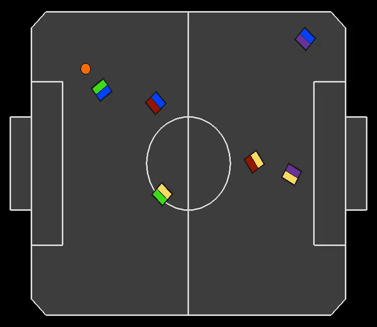

# Replicated Single Agent (RSA) recordings for experiment: "Comparing Learning paradigms on IEEE Very Small Size Soccer Environment" (Section 5.2)

In all recordings, the paradigm we are evaluating is controlling the blue team.

---
### RSA dexterity:
|| ||
|:--:|:--:|:--:|

---
### RSA blocking each other:
|||
|:--:|:--:|

