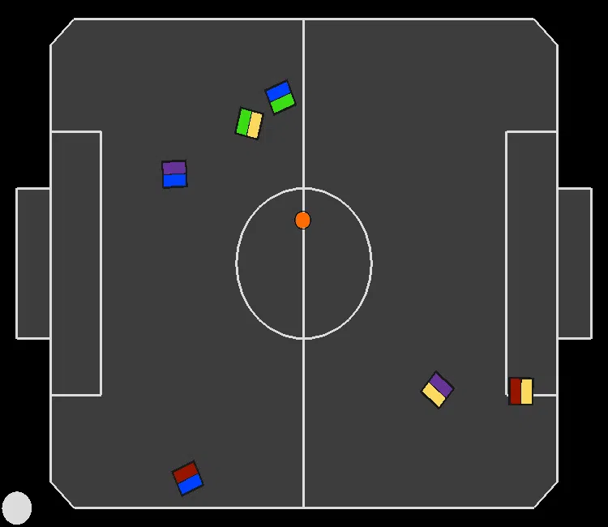
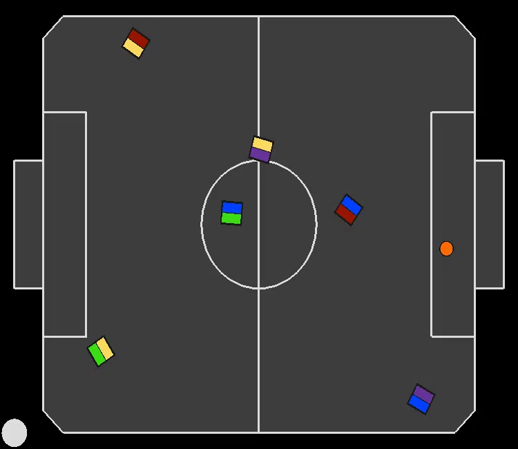
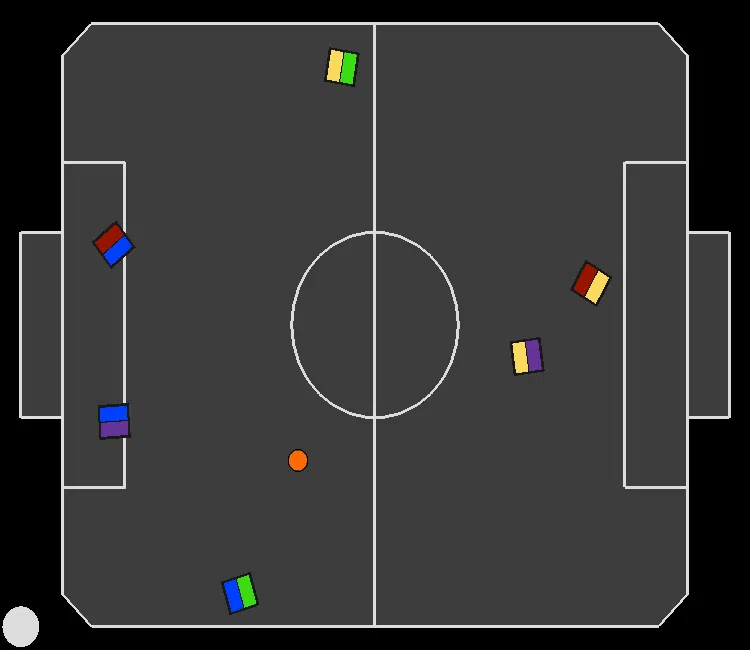
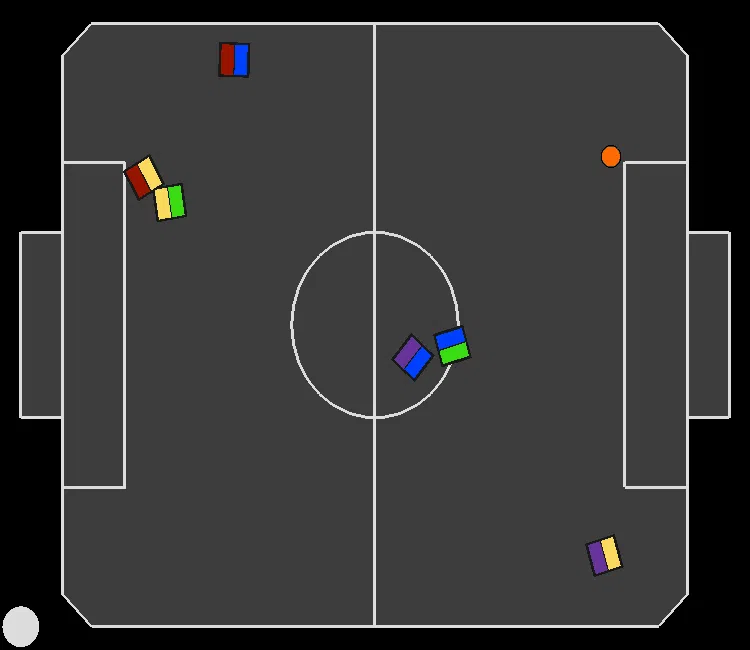
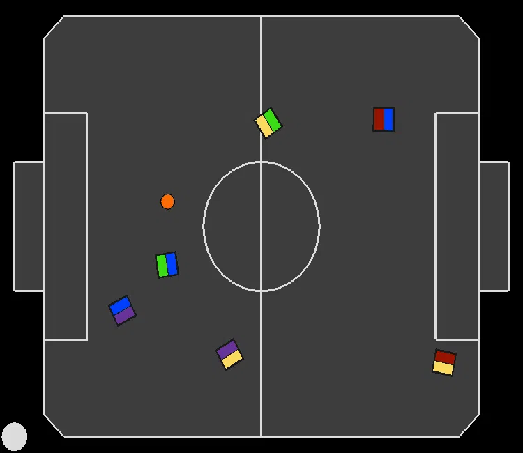
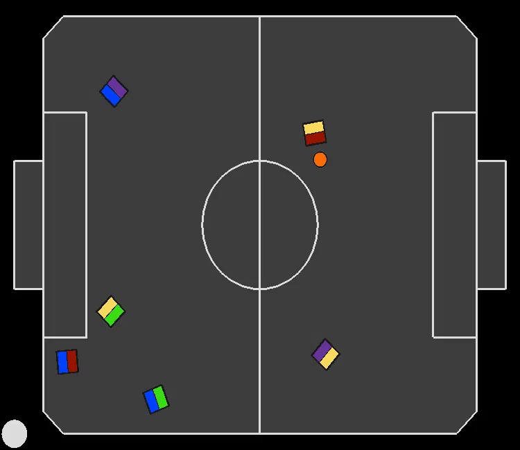
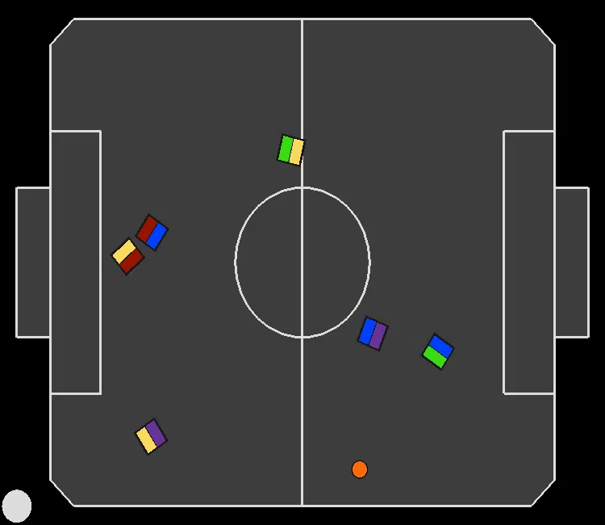
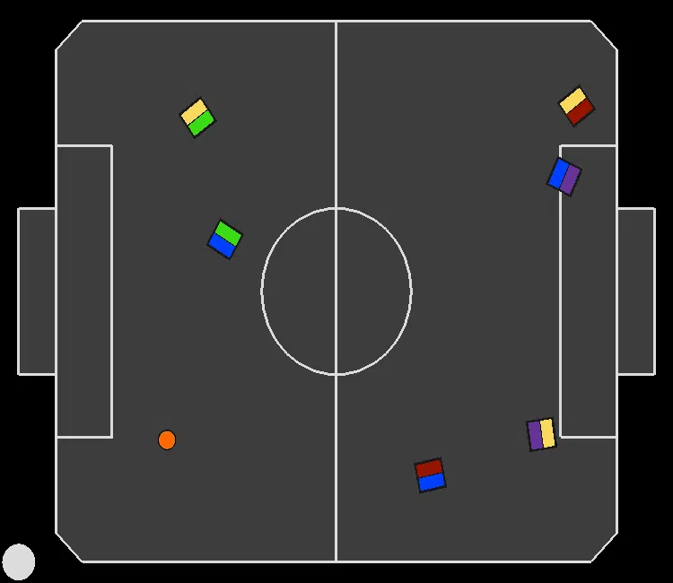

# Joint Action Learners (JAL) recordings for experiment: "Reducing Robot Motion Reward Component Bias" (Section 5.3)

In all recordings, the paradigm we are evaluating is controlling the blue team.

---
### JAL controlling all robots:
|||||
|:--:|:--:|:--:|:--:|

---
### JAL cooperating:
|||||
|:--:|:--:|:--:|:--:|

