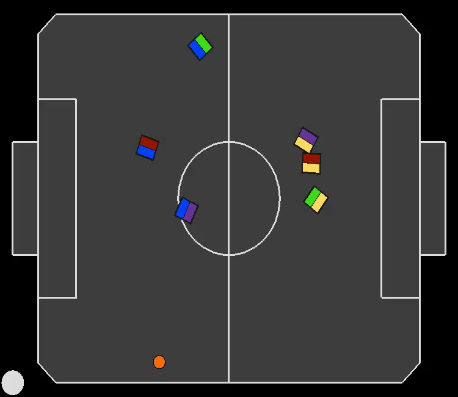
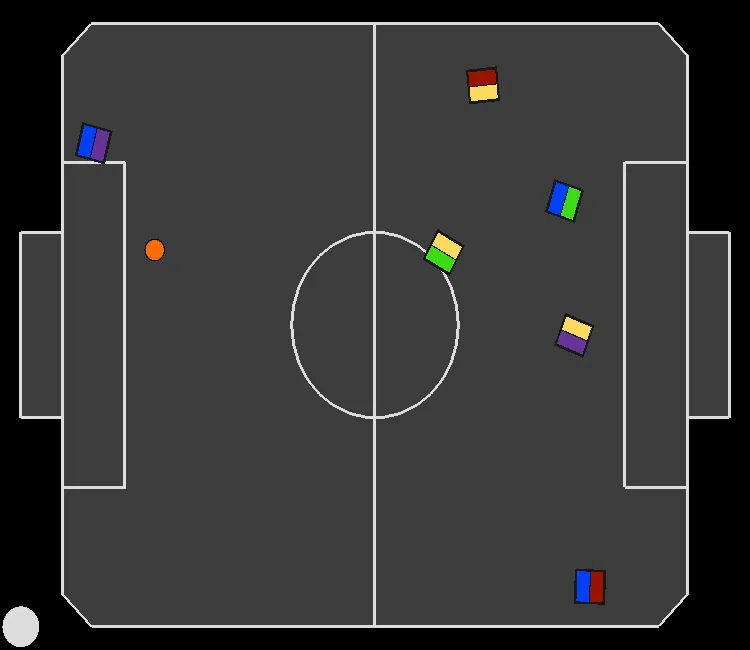
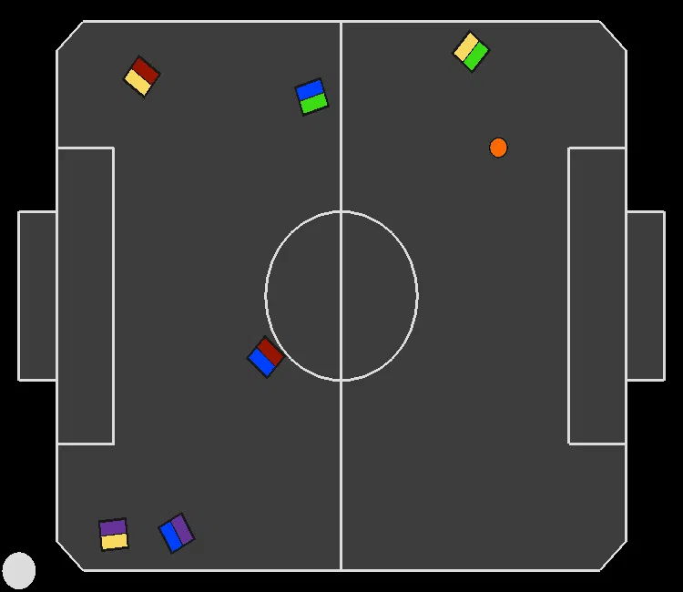
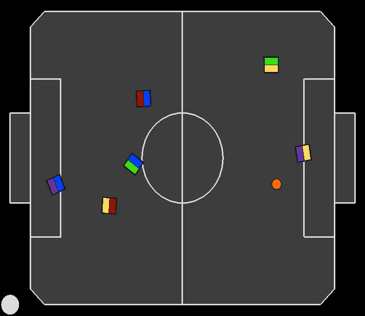
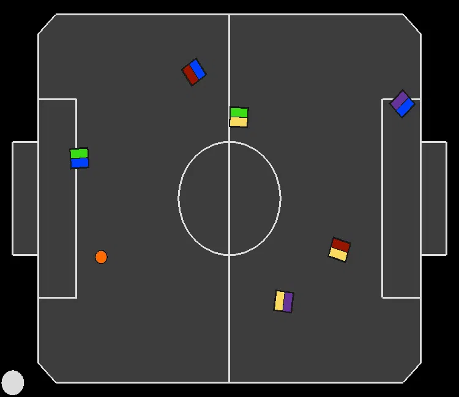

# Replicated Single Agent (RSA) recordings for experiment: "Reducing Robot Motion Reward Component Bias" (Section 5.3)

In all recordings, the paradigm we are evaluating is controlling the blue team.

---
### RSA moving all robots towards the ball:
|||||
|:--:|:--:|:--:|:--:|
|||||

---

