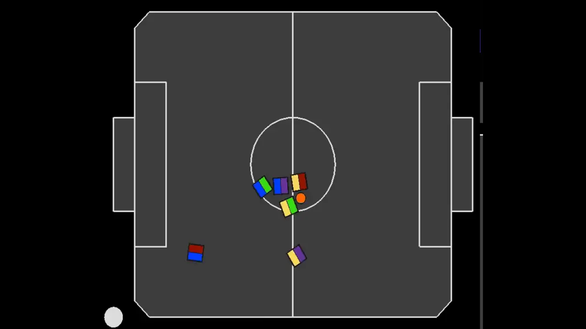
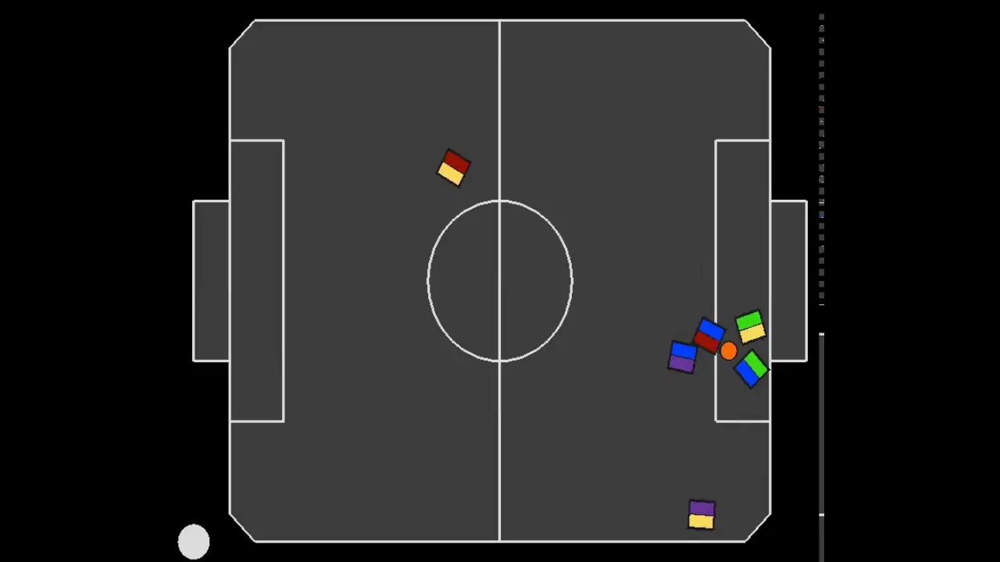

# Independent Learners (IL) recordings for experiment: "Learning Against Intelligent Opponent Policies" (Section 6.1)

In all recordings, the paradigm we are evaluating is controlling the blue team.

---
### IL moving all robots towards the ball:
||||
|:--:|:--:|:--:|
|<video src="1.mp4" controls title="!\[\](1.webp)"></video>||

---
---
### IL pushing opponent away from ball:
|||||
|:--:|:--:|:--:|:--:|
|

---
---
### IL pushing ball side by side:
|||||
|:--:|:--:|:--:|:--:|
|<video src="4.mp4" controls title="Title"></video>|<video src="0.mp4" controls title="Title"></video>

---
---
### IL going towards ball one at a time:
|||||
|:--:|:--:|:--:|:--:|
||<video src="3.mp4" controls title="Title"></video>

---

