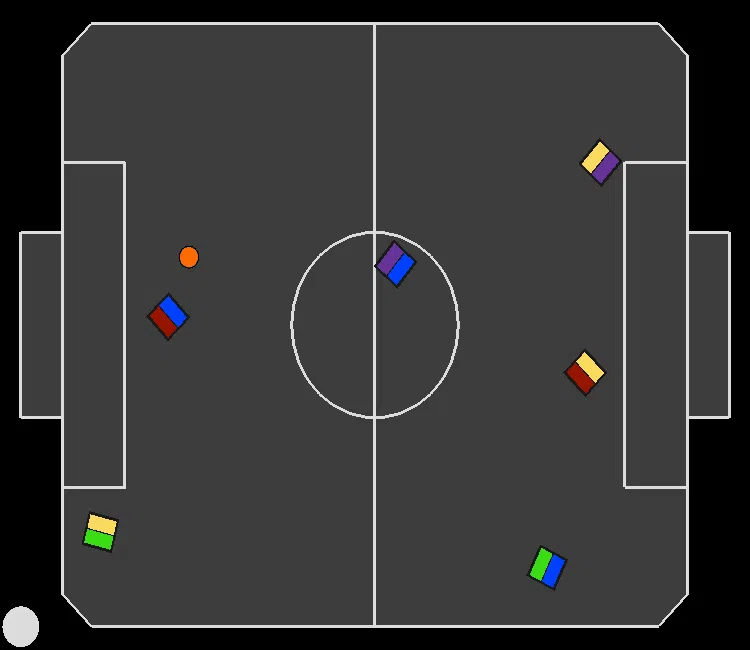
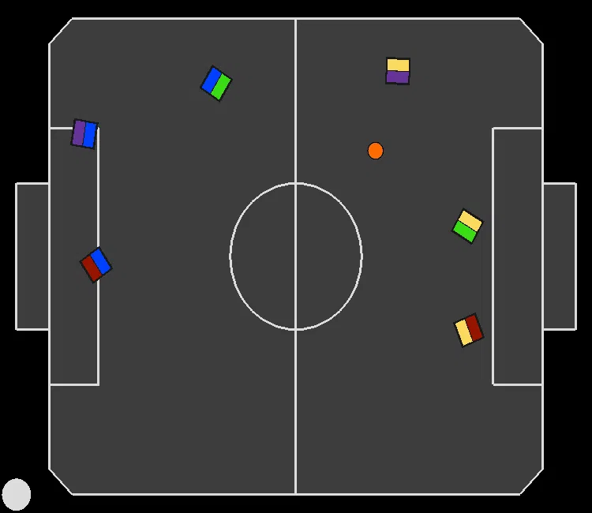
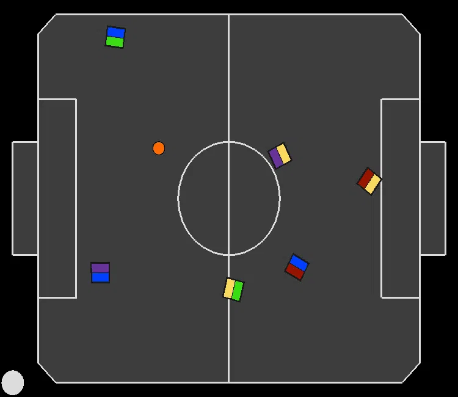

# Joint Action Learners (JAL) recordings for experiment: "Learning Against Intelligent Opponent Policies" (Section 6.1)

In all recordings, the paradigm we are evaluating is controlling the blue team.

---
### JAL cooperating:
|||||
|:--:|:--:|:--:|:--:|
||||<video src="3.mp4" controls title="Title"></video>|

---

