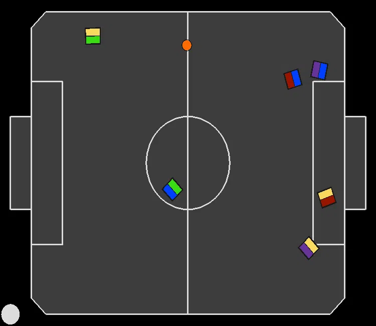
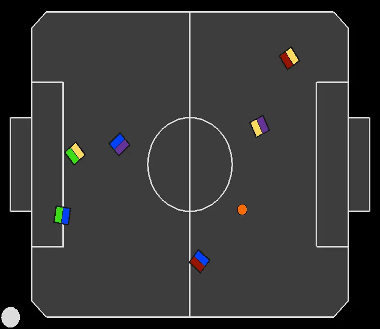
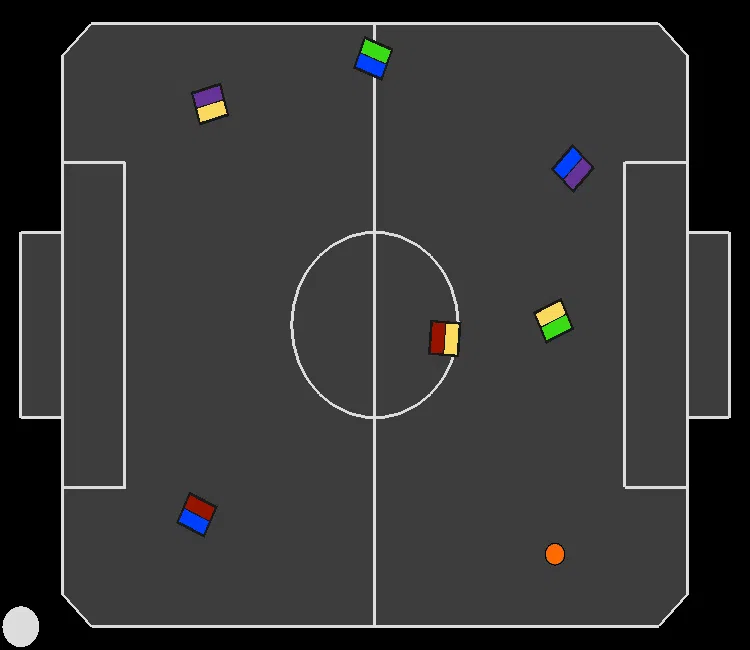

# Replicated Single Agent (RSA) recordings for experiment: "Learning Against Intelligent Opponent Policies" (Section 6.1)

In all recordings, the paradigm we are evaluating is controlling the blue team.

---
### RSA moving all robots towards the ball:
|||||
|:--:|:--:|:--:|:--:|
||

---
---
### RSA blocking each other:
|||||
|:--:|:--:|:--:|:--:|
|