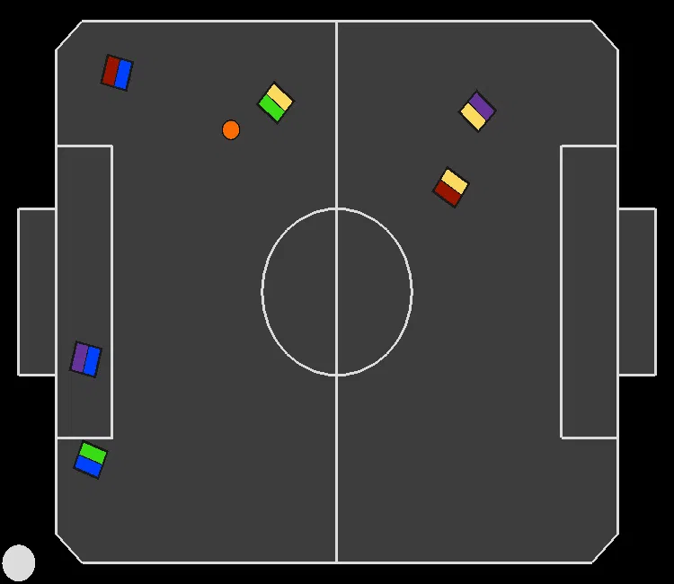

# Independent Learners (IL) recordings for experiment: "Learning To Handle Attacking Fouls" (Section 6.2)

In all recordings, the paradigm we are evaluating is controlling the blue team.

---
### IL avoiding attacking fouls:
|||||
|:--:|:--:|:--:|:--:|
|||||

---

