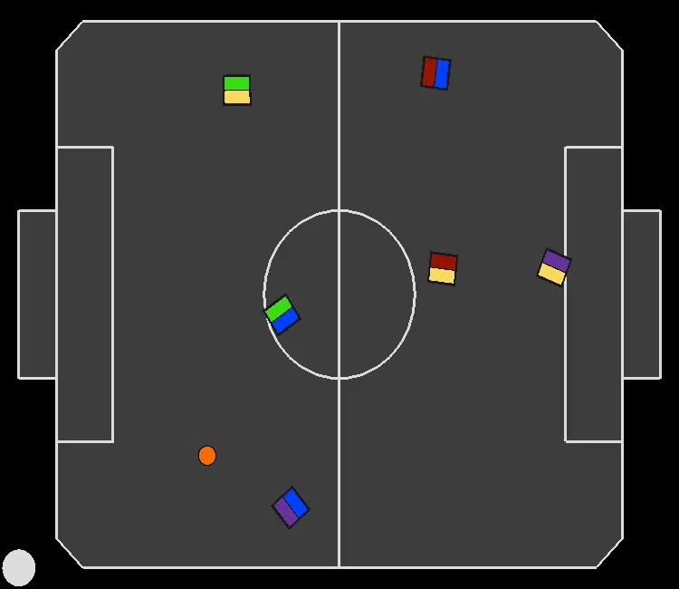
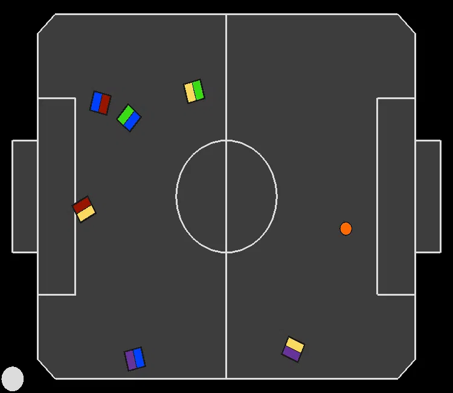
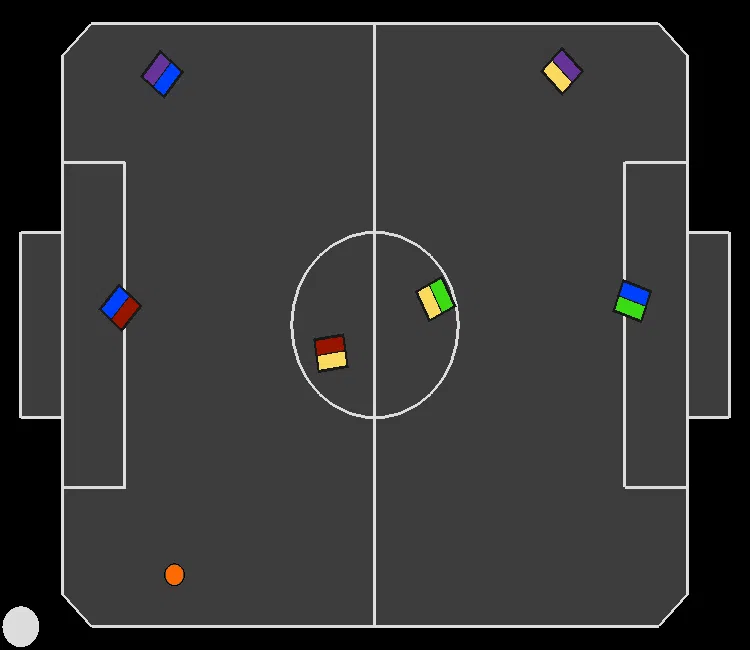
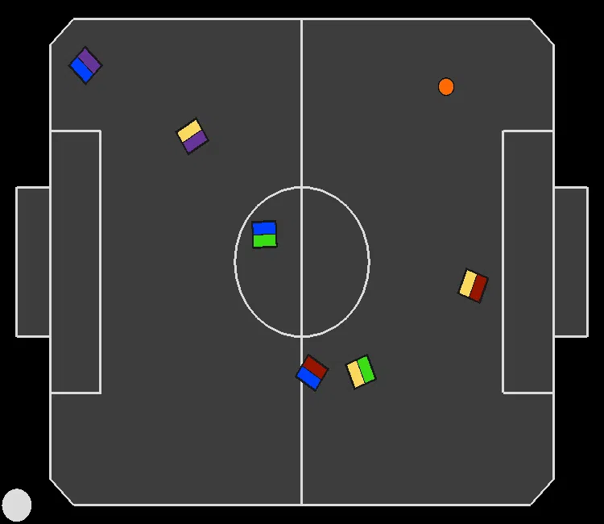

# Joint Action Learners (JAL) recordings for experiment: "Learning To Handle Attacking Fouls" (Section 6.2)

In all recordings, the paradigm we are evaluating is controlling the blue team.

---
### JAL avoiding attacking fouls:
|||||
|:--:|:--:|:--:|:--:|
||||||

---
---
### JAL using only the purple robot to score:
|||||
|:--:|:--:|:--:|:--:|
|<video src="4.mp4" controls title=""></video>|
---
---
### JAL with bad control of red robot:
|||||
|:--:|:--:|:--:|:--:|
|<video src="5.mp4" controls title=""></video>|
