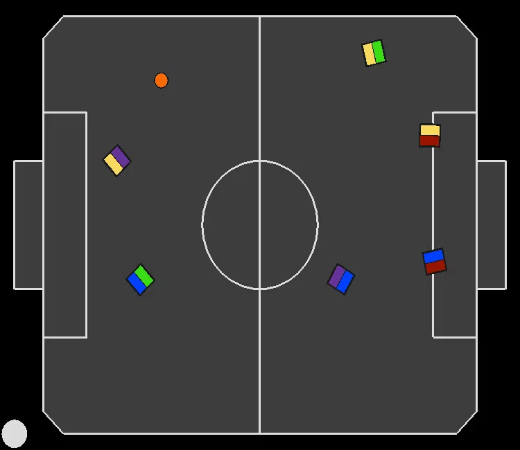

# Replicated Single Agent (RSA) recordings for experiment: "Learning To Handle Attacking Fouls" (Section 6.2)

In all recordings, the paradigm we are evaluating is controlling the blue team.

---
### RSA avoiding attacking foul by 'kicking' the ball from outside the goal area:
||||
|:--:|:--:|:--:|

---
### RSA commiting attacking fouls:
|||
|:--:|:--:|
|

